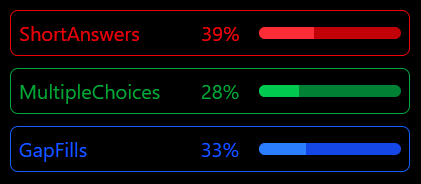

# Title: UpRevise (An AI revision website)

## Description: My revision website uses AI to personalise the types of questions users are prompted with to attempt to increase the improvements students can make when revising. I started this project because I found that some revision methods would fail to help me as much as others. This meant I would waste hours of revision, revising in a way that just wasn't for me. My idea for this prototype was to use a custom script to optimise the ratios of question formats in order to find the best, most effective, combination of question formats (short answers, multiple choice and fill in the gap) because there isn't a 'right' question format for you, it's about weighted variation.

## TLDR: A revision website that adapts to how a user learns to improve studying efficiency

# 

# To view the website, [click here](https://porgsrpogs.hackclub.app/)

## NOTE FOR STARDANCE REVIEWERS: This project is designed to give the best experience for desktop/laptop users as small screens can hinder the website's full experience. In order to ensure fair voting I ask you to only review it if you satisfy the requirements.

### AI Declaration: Although this project wasn't 'vibecoded', LLM's were used in speeding up the production of this website. Multiple models including Copilot, Claude and ChatGPT, were used for debugging issues, writing quick util functions (Such as in the ratio optimiser) and helping me decide a structure for the project. As of now, Hackatime estimates this project as having used AI in ~10% of the time spent developing (50h 30m : 5h)